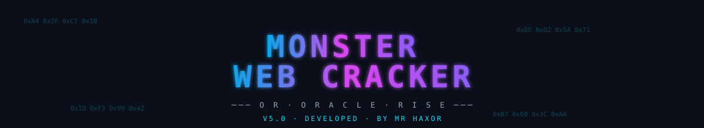

<!-- ═══════════════════════════════════════════════════════════════════ -->
<!--                       MONSTER WEB CRACKER                          -->
<!--                          by MR HAXOR                               -->
<!-- ═══════════════════════════════════════════════════════════════════ -->

<div align="center">

<!-- animated gradient header -->
<a href="https://github.com/MonstarTrader/monster-web-cracker">
  
</a>

<!-- animated typing tagline -->
<a href="https://github.com/MonstarTrader/monster-web-cracker">
  
</a>

<br/>

<!-- inline animated banner (committed svg asset) -->


<br/><br/>

<!-- badge row -->
<p>
  
  
  
  
</p>

<!-- social badge row -->
<p>
  <a href="https://t.me/Monstar_Trading">
    
  </a>
  <a href="https://t.me/Monstar_Trader">
    
  </a>
  <a href="https://github.com/MonstarTrader">
    
  </a>
</p>

<p>
  
  
  
  
</p>

<br/>



<br/>

</div>

---

<div align="center">

### `[ deep crawler · async engine · secret hunter · endpoint miner ]`

</div>

---

<!-- ═══════════════════════════════════════════════════════════════════ -->
<!--                              CONTACT                                -->
<!-- ═══════════════════════════════════════════════════════════════════ -->

## ✦ contact · support

<div align="center">

<a href="https://t.me/Monstar_Trading">
  
</a>

<br/><br/>

<a href="https://t.me/Monstar_Trader">
  
</a>

<br/><br/>

<table>
<tr>
<td align="center" width="50%">

**📢 updates · releases · drops**

join the channel

[`t.me/Monstar_Trading`](https://t.me/Monstar_Trading)

</td>
<td align="center" width="50%">

**💬 questions · bugs · requests**

direct message

[`t.me/Monstar_Trader`](https://t.me/Monstar_Trader)

</td>
</tr>
</table>

</div>

---

## ✦ what it does

<table>
<tr>
<td width="50%" valign="top">

### 🌐 crawl
- recursive site crawl with async worker pool
- follows anchors, iframes, same-host scope
- dedupes URLs, tracks depth per branch
- honors `robots.txt` + recursive `sitemap.xml`

### 📦 extract
- html · css · js · sourcemaps
- images · svg · fonts · docs · media
- archives · wasm · config files
- routed into categorized subfolders

### 🔎 mine
- js endpoint miner (`fetch`, `axios`, `$.ajax`, XHR)
- sourcemap fetcher (`.map` → original source)
- bare `/api/...` literal extraction

</td>
<td width="50%" valign="top">

### 🔐 secret hunter
- 50+ regex signatures, deduped
- AWS · GCP · Azure · GitHub · GitLab
- Slack · Discord · Stripe · Twilio · SendGrid
- JWTs · private keys · DB URIs · S3 buckets
- internal IPs · Telegram bots · webhooks

### 🛰 probe
- ~100 high-signal directory paths
- `.git` · `.env` · `admin` · `swagger` · `actuator`
- response code + size + content-type logged

### 🧪 test
- reflected-parameter marker injection
- form + input inventory per page
- param extraction across every crawled URL

</td>
</tr>
</table>

---

## ✦ install

<details open>
<summary><b>📱 Termux</b></summary>

```bash
pkg update && pkg upgrade -y
pkg install -y python git
pip install --upgrade pip

git clone https://github.com/MonstarTrader/monster-web-cracker.git
cd monster-web-cracker
pip install -r requirements.txt
./run.sh
```
</details>

<details>
<summary><b>🐧 Linux / 🍎 macOS</b></summary>

```bash
git clone https://github.com/MonstarTrader/monster-web-cracker.git
cd monster-web-cracker
./install.sh
./run.sh
```
</details>

<details>
<summary><b>🪟 Windows (cmd / powershell)</b></summary>

```cmd
git clone https://github.com/MonstarTrader/monster-web-cracker.git
cd monster-web-cracker
install.bat
run.bat
```
</details>

---

## ✦ usage

**interactive**

```bash
python mwc.py
```

**one-shot**

```bash
python mwc.py https://target.tld -p 120 -d 4
```

**flags**

| flag | description |
|------|-------------|
| `-p, --pages N`   | max pages to crawl (default `60`) |
| `-d, --depth N`   | max crawl depth (default `3`) |
| `--no-assets`     | skip asset downloads |
| `--no-dirs`       | skip directory probe |
| `--no-seeds`      | skip robots/sitemap seeding |
| `--reckless`      | bigger scope, faster |
| `--no-hex`        | disable boot hex animation |
| `-v, --version`   | print version |

---

## ✦ output tree

```text
MWC_<host>_<timestamp>/
├── pages/          html sources
├── css/            stylesheets
├── js/             scripts
├── sourcemaps/     .map files
├── images/         png · jpg · webp · gif · ico
├── svg/            svg assets
├── fonts/          woff · woff2 · ttf · otf
├── docs/           pdf · txt · csv
├── media/          mp4 · webm · mp3
├── archives/       zip · tar · gz
├── config/         json · xml · yaml
├── wasm/           .wasm binaries
├── assets/         misc
├── raw/            robots.txt + sitemaps
├── reports/
│   ├── secrets.md
│   ├── endpoints.txt
│   ├── dir_hits.md
│   ├── forms.md
│   ├── params.txt
│   ├── reflections.md
│   └── pages.md
└── manifest.json   full run record
```

---

## ✦ demo

<div align="center">


</div>

<details>
<summary><b>🎬 see terminal banner</b></summary>

```text
  ███╗   ███╗██████╗     ██╗  ██╗ █████╗ ██╗  ██╗ ██████╗ ██████╗
  ████╗ ████║██╔══██╗    ██║  ██║██╔══██╗╚██╗██╔╝██╔═══██╗██╔══██╗
  ██╔████╔██║██████╔╝    ███████║███████║ ╚███╔╝ ██║   ██║██████╔╝
  ██║╚██╔╝██║██╔══██╗    ██╔══██║██╔══██║ ██╔██╗ ██║   ██║██╔══██╗
  ██║ ╚═╝ ██║██║  ██║    ██║  ██║██║  ██║██╔╝ ██╗╚██████╔╝██║  ██║
  ╚═╝     ╚═╝╚═╝  ╚═╝    ╚═╝  ╚═╝╚═╝  ╚═╝╚═╝  ╚═╝ ╚═════╝ ╚═╝  ╚═╝

              ───  O R  /  O R A C L E  /  R I S E  ───
```

</details>

---

## ✦ stack

<p align="center">
  
</p>

<p align="center">
  
  
  
  
</p>

---

## ✦ why

Most crawlers either do one thing well or try to do everything and drown you in config. **Monster Web Cracker** does the whole recon pass in a single run, from a single file, and hands you a folder you can actually navigate.

No config files. No daemon. No telemetry. Just a target and a folder full of intel.

---

## ✦ roadmap

- [x] async crawl engine
- [x] secret hunter (50+ signatures)
- [x] directory prober
- [x] js endpoint miner
- [x] sourcemap fetcher
- [x] reflection tester
- [x] form inventory
- [x] modern neon UI + hex animations
- [x] cross-platform (termux · linux · macos · windows)
- [ ] passive subdomain sampler
- [ ] sqlite-backed findings store
- [ ] graph view of crawl tree (html export)
- [ ] `--theme` flag (inferno amber · matrix green · ice cyan)

---

## ✦ star history

<div align="center">

<a href="https://star-history.com/MonstarTrader/monster-web-cracker&Date">
  
</a>

</div>

---

## ✦ contributing

PRs welcome. rules:

1. fork → branch → PR
2. keep changes cross-platform (termux / linux / macos / windows)
3. no new dependencies without strong reason
4. match existing style (compact, modern ui, no fluff)
5. run `python mwc.py --help` + a small local crawl before submitting

see [`CONTRIBUTING.md`](CONTRIBUTING.md).

---

## ✦ license

MIT — see [`LICENSE`](LICENSE).

---

## ✦ author

<div align="center">

<h3>MR HAXOR</h3>

<em>or · oracle · rise</em>

<br/><br/>

<a href="https://t.me/Monstar_Trading">
  
</a>
<a href="https://t.me/Monstar_Trader">
  
</a>
<a href="https://github.com/MonstarTrader">
  
</a>

<br/><br/>

<sub>follow the channel for releases · dm for anything else</sub>

</div>

---

<div align="center">

<!-- animated footer wave -->


<sub>built with teeth. shipped with claws.</sub>

<br/><br/>

<a href="https://t.me/Monstar_Trading">channel</a> ·
<a href="https://t.me/Monstar_Trader">contact</a>

</div>
